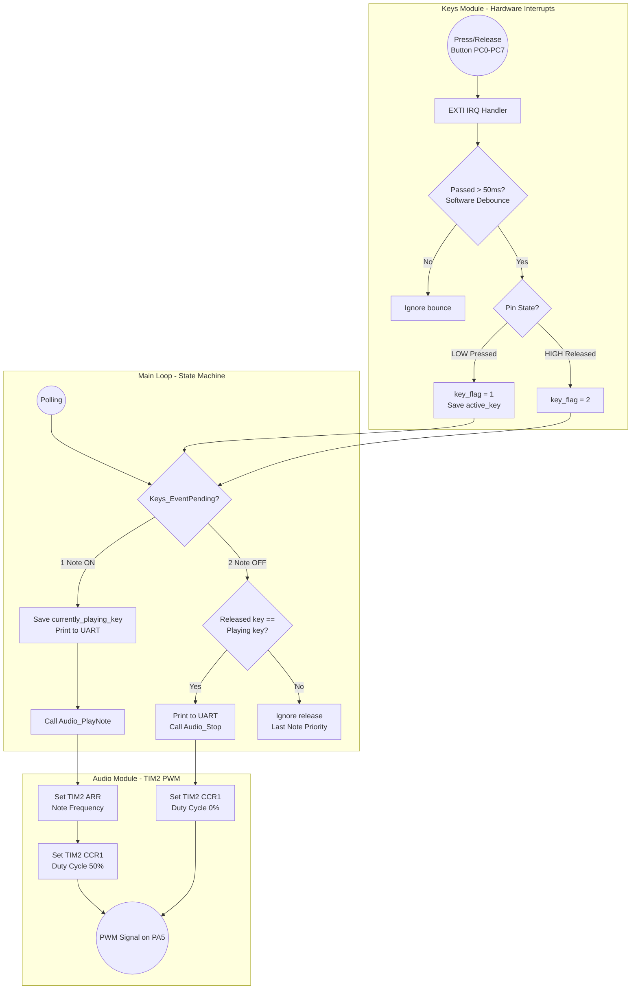

# STM32 Mini Piano Synthesizer

A bare-metal, interrupt-driven digital piano built on the **STM32L476RG Nucleo-64** development board. This project avoids heavy auto-generated HAL loops in favor of a clean, custom event-driven architecture. 

It reads 8 hardware-debounced pushbuttons using External Interrupts (EXTI), synthesizes precise musical frequencies using Hardware Timers (PWM), and streams live diagnostics to a PC via UART.

## Features
* **Bare-Metal PWM Audio:** Uses Timer 2 (TIM2) running at 80 MHz to generate precise frequencies for an 8-note C-Major scale (C4 to C5).
* **Event-Driven Architecture:** 100% non-blocking code. The CPU sleeps or handles other tasks until a button interrupt wakes it up.
* **Last-Note Priority:** Intelligently handles overlapping key presses. A new note will preempt the current note, and releasing a key will only stop the audio if it is the currently sounding note.
* **Double-Layer Debouncing:** Combines physical RC filters (100nF) with a 50ms software debounce timer to completely eliminate mechanical switch bounce and breadboard crosstalk.
* **Live UART Diagnostics:** Hijacked standard C `printf()` to stream real-time button events over USART2 (Virtual COM Port) at 115200 baud.

## Hardware Requirements
* **Microcontroller:** STM32L476RG (Nucleo-64)
* **Inputs:** 8x Tactile Pushbuttons
* **Audio Stage:** LM386 Audio Amplifier Module & 0.5W 8-Ohm Speaker
* **Passive Components:**
  * 8x 10kΩ Resistors (Pull-ups)
  * 9x 100nF Ceramic Capacitors (Hardware debounce + Audio filter)
  * 1x 1kΩ Resistor (Audio filter)
  * 1x 100µF Electrolytic Capacitor (Power rail protection)

## Build Instructions
1. Clone this repository to your local machine.
2. Open **STM32CubeIDE**.
3. Go to `File > Open Projects from File System...`
4. Click `Directory...`, select the cloned repository folder, and click `Finish`.
5. Click the **Hammer icon** (Build) in the top toolbar to compile the project. You should see `0 errors, 0 warnings`.

## Flash & Run Instructions
1. Connect the Nucleo-L476RG board to your PC via a Mini-USB cable.
2. In STM32CubeIDE, click the **Green Bug icon** (Debug) to flash the `.elf` file onto the microcontroller.
3. Click the **Play icon** (Resume) to start the code execution.

## Usage & Diagnostics
1. Open a serial terminal program (like **PuTTY** or **Tera Term**).
2. Connect to the "STMicroelectronics STLink Virtual COM Port".
3. Set the baud rate to **115200** (8 data bits, 1 stop bit, no parity).
4. Press the black **Reset (B2)** button on the Nucleo board. You should see the boot message: `System Booted! Piano Ready.`
5. Press the breadboard buttons. You will hear the synthesized notes through the speaker and see real-time `Note ON` and `Note OFF` events logged in your terminal.

## Software Architecture

---
*Developed as an embedded systems engineering project.*